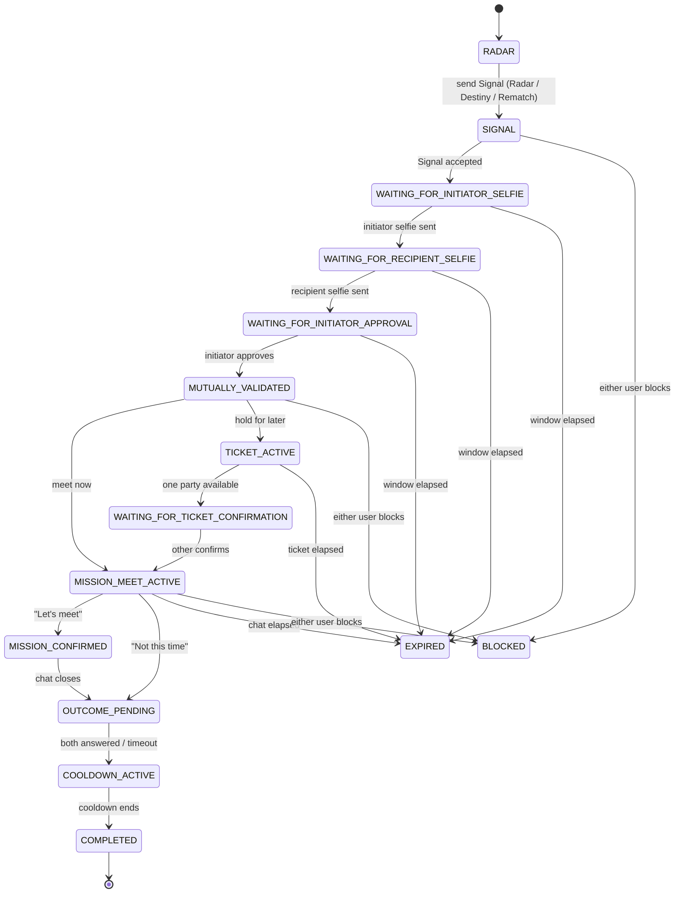
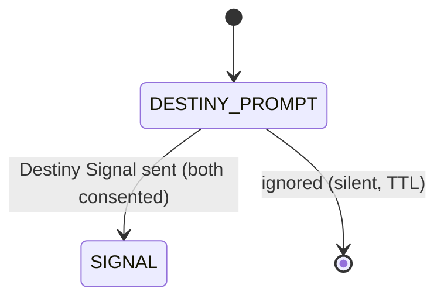

# State Machines

**Status:** Decided (V4.1) · Related: `database/schema.prisma`, `database/DATABASE_INVARIANTS.md`, `api/*`, `architecture/REDIS_ARCHITECTURE.md`

The connection protocol is the core asset of Wingman. All transitions live in `packages/domain` and are
executed atomically (a PostgreSQL transaction, or a Redis Lua script for pure ephemeral state). Controllers
never mutate state directly — they call domain transitions.

## Conceptual sequence



Parallel entry:



## Signal state machine

| From | Event | To | Guards | Effects |
|---|---|---|---|---|
| — | createSignal | PENDING | not blocked either way; no active Signal for pair; sender has quota; not self | insert Signal(isActive=true, expiresAt=+10m); decrement quota; push `signal.received` |
| PENDING | open | OPENED | recipient acts | set openedAt; push nothing to sender |
| OPENED / PENDING | accept | ACCEPTED | recipient acts before expiry | isActive=false; create Connection + ActiveUserLock (atomic); begin selfie window |
| PENDING/OPENED | expire | EXPIRED | now ≥ expiresAt | isActive=false; **no notification** (silent) |
| any active | block | BLOCKED | either blocks | isActive=false; remove from feeds both ways |
| any active | cancel | CANCELLED | sender cancels | isActive=false |

**Silent-expiry rule:** no transition to EXPIRED ever emits a rejection notification. This is enforced in the
domain layer and asserted in tests (`testing/DOMAIN_TEST_MATRIX.md`).

## Connection state machine (detail)

States: `WAITING_FOR_INITIATOR_SELFIE`, `WAITING_FOR_RECIPIENT_SELFIE`, `WAITING_FOR_INITIATOR_APPROVAL`,
`MUTUALLY_VALIDATED`, `TICKET_ACTIVE`, `WAITING_FOR_TICKET_CONFIRMATION`, `MISSION_MEET_ACTIVE`,
`MISSION_CONFIRMED`, `OUTCOME_PENDING`, `COOLDOWN_ACTIVE`, `COMPLETED`, and terminals `EXPIRED`, `CANCELLED`,
`BLOCKED`, `FAILED`.

Windows (server-authoritative `expiresAt`):

| State | Window | Source |
|---|---|---|
| WAITING_FOR_INITIATOR_SELFIE | 5 min (+5 Wingman+) | selfie response window |
| WAITING_FOR_RECIPIENT_SELFIE | 5 min (+5 Wingman+) | selfie response window |
| WAITING_FOR_INITIATOR_APPROVAL | 5 min (+5 Wingman+) | approval window |
| TICKET_ACTIVE | 2h Free / 24h Wingman+ | entitlement `TICKET_MAX_DURATION_SEC` |
| WAITING_FOR_TICKET_CONFIRMATION | 15 min | ticket confirmation |
| MISSION_MEET_ACTIVE | 15 min / 20 min Wingman+ | entitlement `MISSION_MEET_DURATION_SEC` |
| COOLDOWN_ACTIVE | 30 min (≥1 YES) / 15 min (both NO or timeout) | outcome |

Terminal handling: on entering any terminal state the domain releases both `ActiveUserLock` rows, sets
`endedAt`, computes `purgeAt` (+30 days), and — for EXPIRED/CANCELLED after validation — writes an
`ExpiredConnection` row (for Rematch). No selfie bytes, chat, or precise location are ever written.

## Mission outcome derivation

```
metConfirmed = (initiatorResponse == YES) AND (recipientResponse == YES)
```

Computed inside the atomic transition that records the second response (or the timeout). Cooldown length is a
pure function of the two responses (see table above). `Cool Down Skip` sets `Cooldown.skipped = true` and
transitions to COMPLETED early.

## Block / report transitions (cross-cutting)

- **Block** is evaluated *before* any pair-touching transition (signal create/accept, selfie, ticket, mission).
  A block during acceptance closes the Signal as BLOCKED and prevents the Connection from being created.
- **Report during a session** does not change the protocol state by itself; it seals evidence (D-016) and may
  create/append a `ModerationCase`. Repeated independent reports can trigger a temporary `AccountRestriction`
  (never an automatic permanent ban — D-017).

## Reconnection & idempotency

- Clients reconcile by reading the connection's `state` + `expiresAt` and rendering `expiresAt − serverTime`.
- Every state-changing endpoint takes an idempotency key; replays return the current state without side effects.
- Concurrency invariants (single active connection/user, single active signal/pair, `initiator ≠ recipient`,
  `expiresAt > startedAt`) are guaranteed by the database + `ActiveUserLock` + partial unique indexes and are
  enumerated in `database/DATABASE_INVARIANTS.md`.

## Radar (presence) state

Not part of the Connection machine. Presence is Redis-only: `Active`, `Invisible` (default), `Mission` (hidden),
`Cooldown` (read-only). Users in Mission or Cooldown, blocked pairs, and incompatible users are filtered out of
Radar candidates before display.
