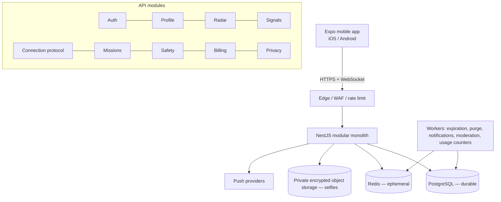

# System Architecture

**Status:** Decided (V4.1) · Related: ADR-001…006, `MODULAR_MONOLITH.md`, `REALTIME_ARCHITECTURE.md`, `REDIS_ARCHITECTURE.md`

## Principles

1. Separate **durable** data (PostgreSQL) from **ephemeral** real-time state (Redis) and **sensitive media**
   (private encrypted storage).
2. Keep the **domain** pure and central; infrastructure is pluggable behind interfaces.
3. **Server owns time.** Timers are absolute and authoritative.
4. Build a globally *evolvable* architecture but deploy **one EU region** first. Add complexity only when
   metrics demand it.

## Target topology (V1)

## Components

**Expo React Native app** — the only client that speaks the real-time protocol. Renders `expiresAt − serverTime`;
never authoritative over timers.

**NestJS modular monolith** — REST for business operations, WebSocket for real-time events. Internally split into
modules (Auth, Profile, Radar, Signals, Connection, Missions, Safety, Billing, Privacy). Modules depend on
`packages/domain` for rules and on repositories for persistence.

**PostgreSQL** — all durable data: users, profile reference data, consent events, entitlements/billing, protocol
metadata (no media/chat/precise location), moderation cases and evidence references. Retention is enforced by
worker jobs reading `purgeAt`.

**Redis** — presence/Radar (GEO), signal timers, selfie sessions (TTL 5 min), mission chat (Stream, TTL ≤ 25 min),
cooldown, rate limits, active-user locks mirror. Sensitive namespaces run with persistence disabled per policy
(see `REDIS_ARCHITECTURE.md`).

**Private object storage** — selfies only, EU bucket, SSE, no public access, lifecycle backstop deletion. Access
via short signed URL or authorized streaming; opaque ids only in Redis.

**Workers** — expiration/timeout consumers, retention purges, push notifications, moderation packaging, usage
counter resets. Idempotent; safe to run concurrently with user actions.

## Data-flow examples

**Send a Signal:** API checks blocks + quota + no active signal for pair → inserts `Signal` → pushes
`signal.received` → schedules a 10-min expiry job. Silent on ignore.

**Accept + selfie:** In one transaction, close the Signal, create `Connection` + two `ActiveUserLock` rows, create
`SelfieExchange` (metadata only). Media uploads go straight to the private bucket via presigned PUT; Redis holds the
opaque id and `expiresAt`.

**Mission Meet:** messages transit WebSocket; anti-contact filter runs before append to the Redis Stream; on close
the key is deleted. On report, evidence is sealed (D-016).

## Why not more, yet

- **No Rust (ADR-006):** proximity math at launch scale runs fine in the monolith / PostGIS / Redis GEO.
- **No microservices:** one deployable, one observability stack, atomic transactions across the protocol.
- **No multi-region (ADR-002):** EU residency + lower latency locally; replication added on evidence of need.

Extraction path when metrics justify it: pull out a geo service, a moderation service, and a notification service
first; introduce Rust for proximity only if it becomes a measured bottleneck.
